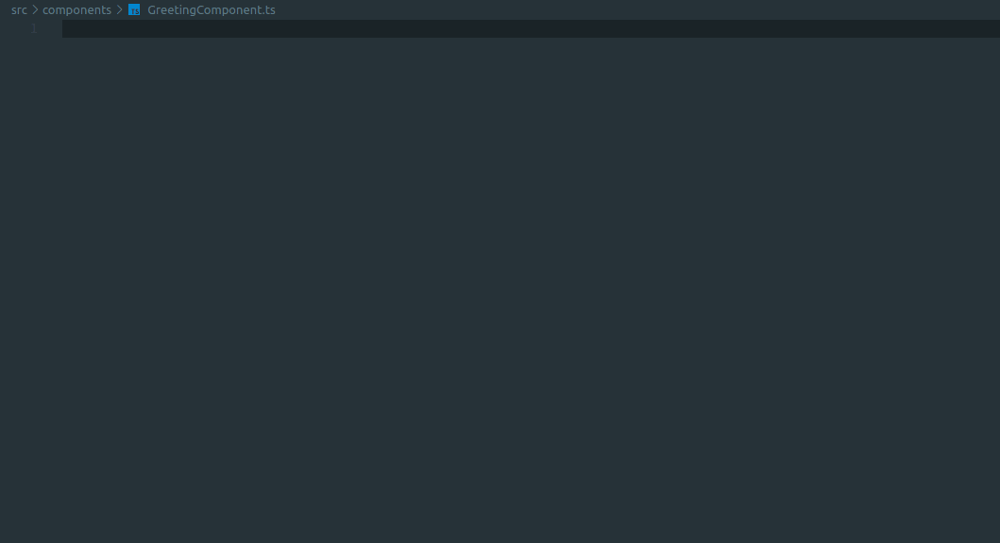

# Jovo V4 Snippets

This [snippet library](https://marketplace.visualstudio.com/items?itemName=jsadlowski.jovo-snippets) is supposed to boost development speed vor Jovo v4 projects in visual studio code!

## Snippets
### Jovo App
|  Trigger | Content                               |
| -------: | --------------------------------------|
| `jc→`    | jovo component                        |
| `jcd→`   | jovo component with data              |
| `jcc→`   | jovo component with config            |
| `jcdc→`  | jovo component with data and config   |
| `jo→`    | jovo output                           |
| `joo→`   | jovo output with options              |
| `jh→`    | jovo handler                          |
| `jp→`    | jovo plugin                           |
| `jpc→`   | jovo plugin with config               |
| `jr→`    | jovo redirect                         |
| `jd→`    | jovo delegate                         |
| `jrs→`   | jovo resolve                          |
| `jhk→`   | jovo hook                             |

### Jovo Language Model
|  Trigger | Content                               |
| -------: | --------------------------------------|
| `jlm→`   | jovo language model                   |
| `ji→`    | jovo intent                           |
| `je→`    | jovo entity                           |
| `jet→`   | jovo entity type                      |
| `jetv→`  | jovo entity type value                |

### i18Next
|  Trigger | Content                               |
| -------: | --------------------------------------|
| `id→`    | i18Next Document                      |
| `it→`    | i18Next Translation                   |

## Usage
This shows how you can quickly create new jovo component with `jcc→` and resolve with `jrs→`

